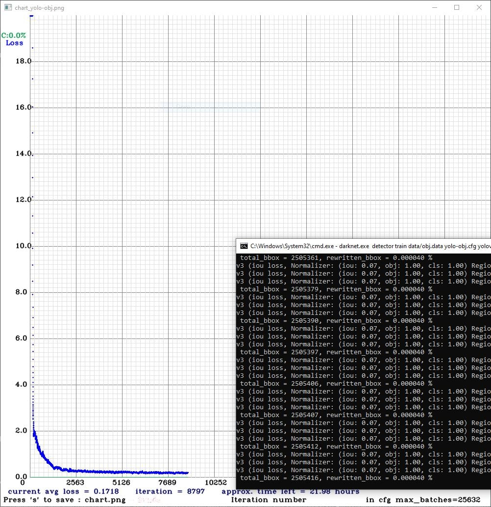

# Automatic plates recognition
Система для автоматического распознавания российских номерных знаков

## Getting started

Requirements

* Python >= 3.7
* RAM >= 32GB
* GPU >= 8GB
* CUDA >= 10.0

Посмотреть пример работы системы (предварительно в директорию models нужно загрузить обученную модель 
[ссылка](https://drive.google.com/drive/folders/1BzMX_qxbXGL1pJ9BkzZgPccJaQEp57OT?usp=sharing) или обучить свою, код 
представлен в ноутбуке в директории models):

````
$ python inference.py
````
Видео по [ссылке](https://drive.google.com/drive/folders/13ioOz5enOzW-IXUqd1GcuxtqtTpWBNrh?usp=sharing).

## Датасет
Для работы был выбран открытый набор данных с kaggle VKCV_2022_Contest_02: Carplates Recognition, содержащий 
автомобильные номера (государственные регистрационные знаки - ГРЗ). На одном изображении может быть 1 или более номерных 
знаков. Файл с описанием ГРЗ для каждого изображения обучающей выборки – train.json, имеет вид:

````
{"file": rel_path", "nums": [[[x1, y1], [x2, y2], [x3, y3],[ x4, y4]], [...]}
````
В обучающей выборке 26806 картинок (jpg: 17929, bmp: 7704), в тестовой – 3157 (jpg: 2225, bmp: 833, jpeg: 51, png: 41, 
JPG: 6, webp: 1).

Данные можно загрузить по [ссылке](https://disk.yandex.ru/d/NANSgQklgRElog).

В директории data скрипт ````dataset_preprocessing.py```` меняет формат данных на подходящий для yolo. В директории 
data представлен результат работы скрипта.

## Модели
Для детекции номерных знаков использовались модели yolo v4 и yolo v5, которые дообучались на наших данных. Основное отличие
yolo от других алгоритмов сверточной нейронной сети (CNN), используемых для обнаружения объектов, заключается в том, что он очень быстро опознает объекты в режиме реального времени. Принцип работы yolo подразумевает ввод сразу всего изображения, которое проходит через сверточную нейронную сеть только один раз. Поэтому для задач высокоскоростного обнаружения объектов в реальном времемни она подходит лучше, чем другие алгоритмы.

Характеристики машины, на которой проводилось обучение: Intel Core i5-10400, NVIDIA GeForce RTX 2070, 32 Gb RAM.

Для обучения yolo v4 использовался фреймворк darknet, в директории models/yolo4 примеры файлов, генерируемых darknet.
Обучение yolo v4:

<p align="left"></p>

Обучение yolo v5 также производилось локально, код обучения представлен в ноутбуке в директории models.

Скачать обученные модели можно по [ссылке](https://drive.google.com/drive/folders/1BzMX_qxbXGL1pJ9BkzZgPccJaQEp57OT?usp=sharing).

Параметры обучения представлены в таблице.

| Модель  | Число эпох обучения | Время обучения | avg_loss | Batch |            parametrs            |
|:-------:|:-------------------:|:--------------:|:--------:|:-----:|:-------------------------------:|
| yolo v4 |        9000         |      22 ч      |   0.17   |  16   | lr:0.01; Adam; momentum: 0.949  | 
| yolo v5 |        1300         |      5 ч       |   0.07   |  16   | lr:0.01; Adam; momentum: 0.937  |

Для оценки качетва обучения моделей были выбраны следующие метрики:
* Precision - доля объектов, названных классификатором положительными и при этом действительно являющимися
положительными. В текущем случае может интерпретироваться как процент верных прогнозов.
* Recall – доля объектов положительного класса из всех объектов положительного класса, найденная алгоритмом. 
* IoU – измеряет перекрытие между двумя границами. Измеряет насколько предсказанная граница совпадает с истинной 
(реальной границей объекта).
* AP – среднее значение для нескольких IoU (минимальное значение IoU, при котором считается положительное совпадение).
mAP 0.5:0.95 соответствует среднему AP для IoU от 0,5 до 0,95 с размером шага 0,05. mAP (средняя средняя точность) — это 
среднее значение AP.

Результаты обучения представлены в таблице.

| Модель  | Precision |  Recall  | mAP_0.5  | mAP_0.5:0.95 |
|:-------:|:---------:|:--------:|:--------:|:------------:|
| yolo v4 |  0.9858   |  0.8858  |  0.8469  |    0.6874    |
| yolo v5 |  0.9946   |  0.9835  |  0.9912  |    0.7646    |

yolo v5 намного быстрее вышла на плато и дает более высокие значения метрик.

## OCR 
Для распознавания символов на изображении использовался Tesseract OCR, для оценки качества использовались метрики 
Character error rate (CER) и Word Error Rate (WER). Средний CER = 30%.

В таблице представлены результаты для инференсных изображений.

| Метрика |  1.jpg  |  2.jpg  | 3.jpg | 
|:-------:|:-------:|:-------:|:-----:|
|   CER   |  8.33   |  25.0   | 9.09  | 
|   WER   |  100.0  |  100.0  | 100.0 | 

Для улучшения качества распознавания была предпринята попытка дообучения Tesseract OCR на собственных данных.
Для этого были собраны и размечены (посимвольно) изображения номерных знаков. Скрипты для вырезания номерных знаков из
изображений и перевода полученных номерных табличек в ч/б изображения находятся в директории utils (пример работы 
скриптов там же). Для разметки использовался jTessBoxEditor.
Из полученного .tif файла с помощью Serak Trainer For Tesseract был сгенерирован файл ````rus.traineddata````, который 
нужно поместить в каталог к языковым моделям ````/usr/local/share/tessdata/````. 

В таблице представлены результаты для инференсных изображений.

| Метрика | 1.jpg  |  2.jpg  | 3.jpg  | 
|:-------:|:------:|:-------:|:------:|
|   CER   |  0.0   |  8.33   |  0.0   | 
|   WER   |  0.0   |  100.0  |  0.0   | 
